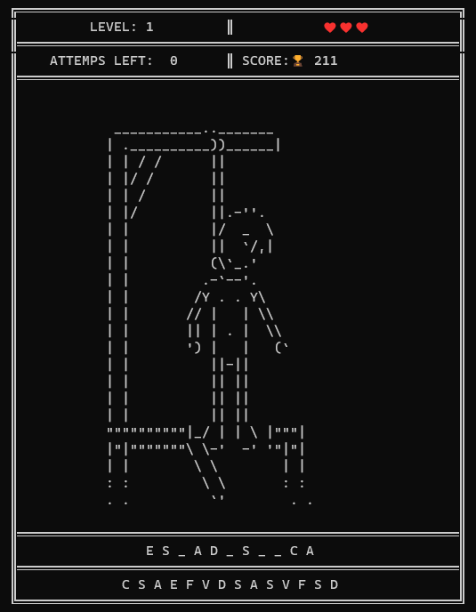

# Hangman 

 

This Hangman Game is the last  challenge  for a python course  called  
"Curso de Python Intermedio: Comprehensions, Lambdas y Manejo de Errores" in [PLATZI](https://platzi.com/cursos/python-intermedio/)


### Installation

just clone the repository 
 
## Usage
into the project directory, just run this command 
```
$ python main.py
```
## Game

## WIN 

## GAME OVER 


 